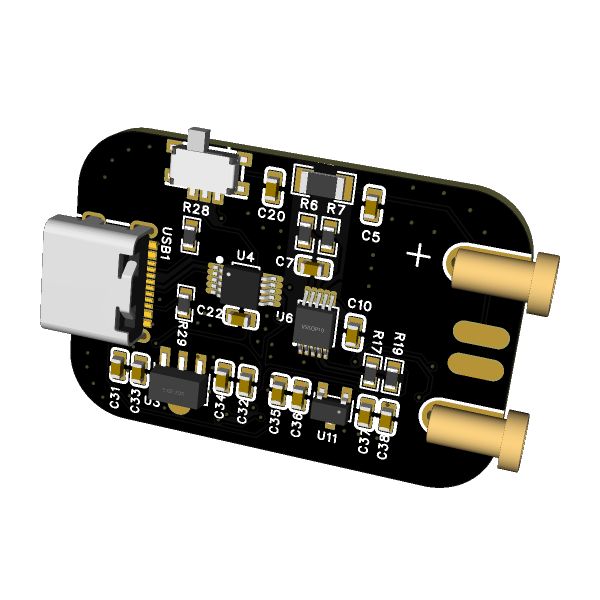
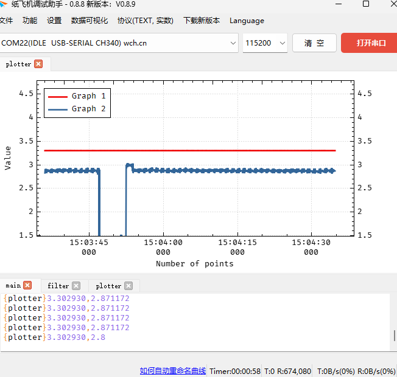
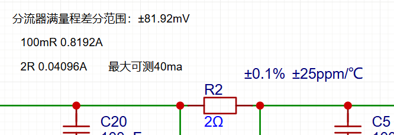
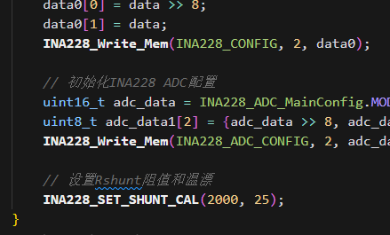

<p align="center">
  
</p>
  <h1 align="center">
  低功耗分析仪
</h1>

使用纸飞机串口助手观察曲线（电压/V,电流/mA）：


根据自己要测的最大电流，修改分流电阻提高分辨率：



改完电阻修改程序 INA228 设置：



# 目录树:

```
LPA
├─ .ccsproject
├─ .clangd
├─ .cproject
├─ .project
├─ HAL
│  ├─ HAL_I2C.c
│  ├─ HAL_I2C.h
│  ├─ HAL_timer.c
│  ├─ HAL_timer.h
│  ├─ HAL_uart0.c
│  └─ HAL_uart0.h
├─ HardWare
│  ├─ INA228.c
│  └─ INA228.h
├─ includes.h
├─ main.c
├─ main.syscfg
├─ README.md
└─ targetConfigs
   ├─ MSPM0L1306.ccxml
   └─ readme.txt

```
